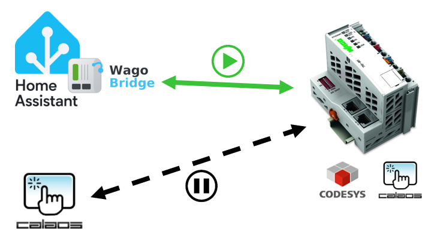
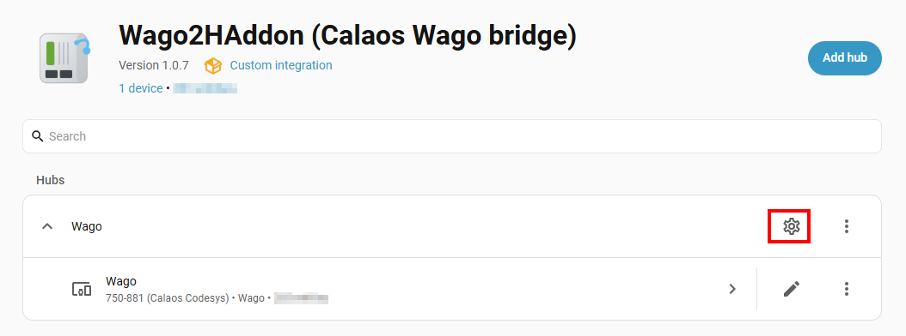
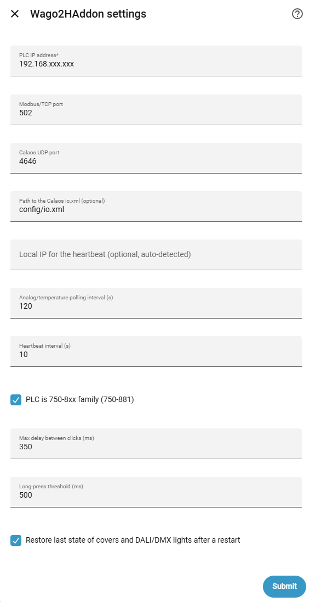
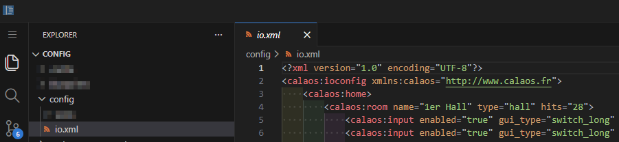

# Wago2Haddon Integration

[](https://github.com/hacs/integration)
[](https://github.com/fredsch/Wago2HAddon/releases)
[](https://github.com/fredsch/Wago2HAddon/wiki)

## What is Wago2HAddon?

  

The **Wago2Haddon** integration allows you to easily switch a **[Calaos](https://www.calaos.fr/)** installation based on a Wago 750-881 PLC to **Home Assistant** without using intermediary services (Docker, MQTT, API, etc.).
The only requirement is to retrieve the current `IO.XML` file, upload it into the integration, and create the automations (rules).

- For an `existing installation`, this integration is non-intrusive and allows you to switch from **[Calaos](https://www.calaos.fr/)** to **Home Assistant** and vice versa without modifying the Wago PLC programming, while maintaining fallback mode functionality.

- For a `new installation`, the **Wago2Haddon** integration combined with **[Calaos Codesys](https://github.com/calaos/calaos_wago)** programming allows you to use a `Wago 750-881` PLC. 
Unlike HA's Modbus TCP protocol, this model suffers from no latency and provides a fallback mode (during HA maintenance or a system crash).

## What the integration does

- **Digital inputs** (e.g. 750-1405 / 750-430 terminals): single click, **double
  click**, **triple click** and **long press**, decoded on the gateway side from
  the raw edges sent by the PLC. Each input becomes an `event` entity (plus a
  `binary_sensor` reflecting the raw line state).
- **Digital outputs** (e.g. 750-1504 / 750-430 terminals): relays, lights,
  pumps… exposed as `light` (when flagged as lighting) or `switch`
  (relay/pump/heater/valve).
- **Shutters** (`WOVoletSmart`): a `cover` entity with **position estimated** from
  the configured **up/down travel times in seconds** (since the internal program is
  suspended, the position logic lives in the gateway).
- **DALI** (750-641 terminal): single dimmable lights (`light` with brightness) or
  **RGB** (`light` with color), via `WAGO_DALI_SET` / `WAGO_DALI_GET`.
- **Analog / temperature** (750-640 terminal + PT100/PT1000 probes): a `sensor`
  **read every 2 minutes** by default (configurable interval), signed value
  divided by 10 for temperature.
- **Internal program suspension**: while the gateway runs, a periodic *heartbeat*
  keeps the PLC in "server mode", which **suspends** its standalone program
  (`ManageOutput`). See below.
- **PLC diagnostics**: two diagnostic entities are created automatically per PLC —
  an Online/Offline **connectivity** `binary_sensor` (Modbus-probed every 30 s) and
  a `sensor` showing the **Calaos program version** installed on the Wago
  (`WAGO_GET_VERSION` command). The version also appears directly on the device
  page ("Firmware version" field).


## Prerequisites
- A Wago 750-881 PLC (other possible models, but untested) equipped with [Calaos CoDeSys 2.3](https://github.com/calaos/calaos_wago) firmware. 
- The `IO.XML` file to be retrieved using [Calaos Installer](https://www.calaos.fr/download/stable/calaos_installer/) or via SSH from the Calaos server

## Installation
1. Install this integration with HACS or HACS → ⋮ menu → Custom repositories → add this repository's URL, category Integration.

[](https://my.home-assistant.io/redirect/hacs_repository/?owner=fredsch&repository=Wago2HAddon&category=integration)

2. Restart Home Assistant

3. Settings → Devices & services → Add integration → Wago2HAddon.

4. Configure the integration :

 



| Field | Purpose | Default |
|-------|---------|---------|
| PLC IP address | Wago IP | — |
| Modbus/TCP port | Modbus | 502 |
| Calaos UDP port | Heartbeat / DALI / inputs | 4646 |
| Path to `io.xml` | Automatic entity import | (optional) |
| Local IP | Destination for input notifications | auto-detected |
| Analog/temperature interval | Read cadence | 120 s |
| Heartbeat interval | Heartbeat cadence | 10 s |
| 750-8xx family | Output address offset (+4096) | true |
| Max delay between clicks | Double/triple window | 350 ms |
| Long-press threshold | Duration of a long press | 500 ms |
| Restore state after restart | Shutters and DALI/DMX lights recover their last state | enabled |


### Importing the Calaos `io.xml` file

 

The easiest path is to let the integration read your existing Calaos
configuration. 
Copy your `io.xml` (e.g. `io.xml`) into Home Assistant's `/config` folder and point to it (e.g. `/config/io.xml`). 
The integration keeps only the **Wago** entities of the configured PLC (Calaos' MQTT, scenarios, cameras and internal timers are ignored). 
All your rooms and entities are recreated automatically, named `Room - Name`.

To reload after editing the file: **⋮ → Reload** on the integration.

## Internal-program suspension mechanism

The Calaos Codesys firmware has a `HEARTBEAT` variable:

- receiving a `WAGO_HEARTBEAT` (UDP 4646) re-arms a 30 s timer;
- while it does not expire, `HEARTBEAT = TRUE` and the `ManageOutput` block
  (teleruptors, shutters, standalone DALI) is **not executed**: the PLC is driven
  by the gateway;
- if no heartbeat arrives for 30 s, `HEARTBEAT = FALSE`: the PLC falls back to
  **standalone** mode (safety).

Wago2HAddon sends `WAGO_SET_SERVER_IP <ip>` then `WAGO_HEARTBEAT` every 10 s. When
you stop the integration, the PLC therefore automatically resumes its internal
logic after 30 s.

## Entity mapping

| Calaos type | HA entity | Details |
|-------------|-----------|---------|
| `WIDigitalBP` | `event` + `binary_sensor` | single click |
| `WIDigitalTriple` | `event` + `binary_sensor` | single / double / triple |
| `WIDigitalLong` | `event` + `binary_sensor` | single / long |
| `WODigital` (light) | `light` | on/off |
| `WODigital` (relay/pump/heater…) | `switch` | on/off (by Calaos `io_style`) |
| `WOVolet` / `WOVoletSmart` | `cover` | timed position |
| `WODali` | `light` | 0-100 % dimming |
| `WODaliRVB` | `light` | RGB color |
| `WITemp` | `sensor` | temperature °C (÷10) |
| `WIAnalog` | `sensor` | analog value |

## Address map (identical to `calaos_base`)

Communication over **two channels**:

**Modbus/TCP (port 502, slave 1)**

| Operation | Function | Address |
|-----------|----------|---------|
| Read a digital input | FC1 (read coils) | `var` |
| Write a digital output | FC5 (force coil) | `var + 4096` (750-8xx family) |
| Read back a digital output | FC1 (read coils) | `var + 512` (fallback `var`) |
| Read an analog register | FC3 (read holding) | `var` (temperature = signed ÷10) |

**UDP (port 4646)**

| Message | Direction | Format |
|---------|-----------|--------|
| Heartbeat | HA → PLC | `WAGO_SET_SERVER_IP <ip>` then `WAGO_HEARTBEAT` |
| Input change | PLC → HA | `WAGO INT <var> <0\|1>` |
| DALI command | HA → PLC | `WAGO_DALI_SET <line> <group> <address> <dimm%> <fade>` |
| DALI read | HA ↔ PLC | `WAGO_DALI_GET <line> <address>` → `WAGO_DALI_GET <0\|1> <dimm%>` |
| Program version | HA ↔ PLC | `WAGO_GET_VERSION` → `WAGO_GET_VERSION <H>.<L> 750-841` |

## Input automations (click / double / long)

Two ways to trigger an automation from a button:

1. **On the `event` entity** (standard): in the automation, "When an event
   occurs" trigger → the `event.<room>_<name>` entity → type `single_click` (or
   `double_click`, `triple_click`, `long_press`).

2. **On the bus event** (most robust, never de-duplicated):
   ```yaml
   triggers:
     - trigger: event
       event_type: wago2haddon_event
       event_data:
         entity_id: event.living_room_switch
         type: single_click
   ```

Each button emits both on every action; pick whichever you prefer.

**Note about the single click of a `WIDigitalTriple` switch:** because a single
click must be distinguished from a double/triple, the `single_click` event is only
emitted at the **end of the multi-click window** (350 ms by default) — this is
expected. If a given button is never used for double/triple clicks and you want an
immediate reaction, lower "Max delay between clicks" in the options (e.g. 150 ms).

**If clicks are occasionally "missed":** make sure **only one thing** is listening
on UDP port 4646 — no running Calaos server and no second instance of the
integration, otherwise input packets may be shared between them. The log shows
`Could not bind UDP port 4646` if the port is already taken.

## State restore after a restart

Shutters have no hardware position feedback and DALI/DMX lights have no read-back,
so by default they would come back "unknown" (shutters) or "off" (DALI/DMX) after a
Home Assistant restart. With **"Restore state after restart"** enabled (default),
their last state is restored via `RestoreEntity`. This is accurate here because the
PLC's internal program is suspended, so only Home Assistant can change those
outputs while it is stopped. On/off relays and lights are unaffected: they always
re-read their real state from the PLC at startup.

## Technical notes

- **Self-contained** Modbus/TCP client (no `pymodbus` dependency, so no version
  clash with the copy Home Assistant already ships).
- `iot_class: local_push`: inputs arrive in real time over UDP; only analog sensors
  are polled periodically.
- DALI state is optimistic, read once at startup for genuine DALI addresses.

## License

GPLv3, like the Calaos project whose protocol is re-implemented here.
